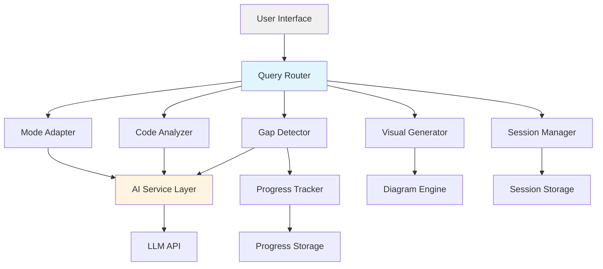

# Design Document: AstroX

## Overview

AstroX is an AI-powered learning assistant that adapts to different learning contexts through three distinct modes (Exam, Concept, Build), provides intelligent code analysis with line-by-line explanations, detects conceptual gaps in student understanding, and generates visual learning aids. The system is designed as a hackathon prototype focusing on meaningful AI integration and clear educational value.

The architecture follows a modular design with four core processing components (Mode Adapter, Code Analyzer, Gap Detector, Visual Generator) orchestrated by a central Query Router. This design enables independent enhancement of each capability while maintaining a cohesive user experience.

## Architecture

### High-Level Architecture



### Component Responsibilities

1. **Query Router**: Analyzes incoming queries and routes to appropriate processing components
2. **Mode Adapter**: Applies learning mode transformations to responses
3. **Code Analyzer**: Parses code, generates explanations, identifies errors, suggests improvements
4. **Gap Detector**: Analyzes user inputs to identify conceptual gaps
5. **Visual Generator**: Creates flowcharts, concept maps, and diagrams
6. **Session Manager**: Maintains conversation context and user state
7. **Progress Tracker**: Records and analyzes learning progress over time

## Components and Interfaces

### Query Router

**Purpose**: Central orchestrator that determines query type and routes to appropriate processors.

**Interface**:
```typescript
interface QueryRouter {
  processQuery(query: Query, session: Session): Promise<Response>
  determineQueryType(query: Query): QueryType
  routeToProcessors(query: Query, type: QueryType): Promise<ProcessorResult[]>
  combineResults(results: ProcessorResult[]): Response
}

type QueryType = 
  | 'code_analysis'
  | 'concept_question'
  | 'visual_request'
  | 'gap_assessment'
  | 'general_question'

interface Query {
  text: string
  code?: string
  language?: ProgrammingLanguage
  attachments?: Attachment[]
  timestamp: Date
}

interface Response {
  content: string
  visualAids?: VisualAid[]
  codeExamples?: CodeExample[]
  detectedGaps?: ConceptualGap[]
  suggestions?: string[]
}
```

**Behavior**:
- Analyzes query content to determine if it contains code, requests visuals, or assesses understanding
- Routes to multiple processors when query requires combined capabilities
- Aggregates results from processors into coherent response
- Applies session context to maintain conversation continuity

### Mode Adapter

**Purpose**: Transforms responses based on active learning mode (Exam, Concept, Build).

**Interface**:
```typescript
interface ModeAdapter {
  applyMode(content: string, mode: LearningMode): string
  getCurrentMode(session: Session): LearningMode
  setMode(session: Session, mode: LearningMode): void
}

type LearningMode = 'exam' | 'concept' | 'build'

interface ModeTransformation {
  mode: LearningMode
  maxLength?: number
  includeExamples: boolean
  includeAnalogies: boolean
  includeCode: boolean
  detailLevel: 'concise' | 'moderate' | 'detailed'
}
```

**Mode Characteristics**:
- **Exam Mode**: Concise (2-3 sentences), direct answers, minimal examples, focus on key facts
- **Concept Mode**: Detailed explanations, multiple examples, analogies, step-by-step breakdowns
- **Build Mode**: Practical focus, code examples, best practices, implementation patterns

### Code Analyzer

**Purpose**: Parses code submissions and generates explanations, error analysis, and improvement suggestions.

**Interface**:
```typescript
interface CodeAnalyzer {
  analyzeCode(code: string, language: ProgrammingLanguage): CodeAnalysis
  explainLineByLine(code: string, language: ProgrammingLanguage): LineExplanation[]
  detectErrors(code: string, language: ProgrammingLanguage): CodeError[]
  suggestImprovements(code: string, language: ProgrammingLanguage): Improvement[]
}

interface CodeAnalysis {
  structure: CodeStructure
  lineExplanations: LineExplanation[]
  errors: CodeError[]
  improvements: Improvement[]
  complexity: ComplexityMetrics
}

interface LineExplanation {
  lineNumber: number
  code: string
  explanation: string
  concepts: string[]
}

interface CodeError {
  lineNumber: number
  errorType: 'syntax' | 'logical' | 'runtime' | 'style'
  message: string
  reasoning: string
  fix: string
}

interface Improvement {
  category: 'performance' | 'readability' | 'best_practice' | 'security'
  description: string
  before: string
  after: string
  impact: 'low' | 'medium' | 'high'
}

type ProgrammingLanguage = 'python' | 'javascript' | 'java' | 'cpp' | 'typescript'
```

**Processing Pipeline**:
1. Parse code using language-specific parser or AST analysis
2. Generate line-by-line explanations with concept tagging
3. Identify errors through static analysis and pattern matching
4. Suggest improvements based on best practices and common patterns
5. Format output according to active learning mode

### Gap Detector

**Purpose**: Identifies conceptual gaps from user explanations, code attempts, and quiz responses.

**Interface**:
```typescript
interface GapDetector {
  analyzeExplanation(explanation: string, topic: string): ConceptualGap[]
  analyzeCodeAttempt(code: string, expectedConcepts: string[]): ConceptualGap[]
  analyzeQuizResponse(question: string, answer: string, correctAnswer: string): ConceptualGap[]
  categorizeGaps(gaps: ConceptualGap[]): GapCategory[]
  generateRecommendations(gaps: ConceptualGap[]): LearningRecommendation[]
}

interface ConceptualGap {
  concept: string
  severity: 'minor' | 'moderate' | 'critical'
  evidence: string
  relatedConcepts: string[]
  detectedFrom: 'explanation' | 'code' | 'quiz'
}

interface GapCategory {
  topic: string
  gaps: ConceptualGap[]
  priority: number
}

interface LearningRecommendation {
  gap: ConceptualGap
  resources: string[]
  exercises: string[]
  estimatedTime: string
}
```

**Detection Strategies**:
- **From Explanations**: Compare user explanation against reference explanations, identify missing key concepts
- **From Code**: Analyze error patterns (e.g., confusion between = and ==, missing loop termination)
- **From Quizzes**: Map incorrect answers to underlying misconceptions
- Use AI to infer implicit gaps from patterns across multiple interactions

### Visual Generator

**Purpose**: Creates flowcharts, concept maps, and diagrams to support visual learning.

**Interface**:
```typescript
interface VisualGenerator {
  generateFlowchart(process: ProcessDescription): VisualAid
  generateConceptMap(concepts: Concept[], relationships: Relationship[]): VisualAid
  generateArchitectureDiagram(components: Component[], connections: Connection[]): VisualAid
  generateFromDescription(description: string, type: VisualizationType): VisualAid
}

interface VisualAid {
  type: VisualizationType
  format: 'mermaid' | 'svg' | 'png'
  content: string
  description: string
  labels: Label[]
}

type VisualizationType = 
  | 'flowchart'
  | 'concept_map'
  | 'architecture_diagram'
  | 'sequence_diagram'
  | 'tree_diagram'

interface ProcessDescription {
  steps: Step[]
  decisions: Decision[]
  loops: Loop[]
}

interface Concept {
  id: string
  name: string
  description: string
  level: number
}

interface Relationship {
  from: string
  to: string
  type: 'is_a' | 'has_a' | 'uses' | 'depends_on' | 'related_to'
  label?: string
}
```

**Generation Approach**:
- Use Mermaid syntax for diagram generation (lightweight, text-based, renderable)
- Parse natural language descriptions to extract structure
- Apply consistent styling and layout rules
- Include descriptive labels and legends
- Provide text alternatives for accessibility

### Session Manager

**Purpose**: Maintains conversation context and user state across interactions.

**Interface**:
```typescript
interface SessionManager {
  createSession(userId?: string): Session
  getSession(sessionId: string): Session
  updateSession(sessionId: string, updates: Partial<Session>): void
  endSession(sessionId: string): void
  addToHistory(sessionId: string, query: Query, response: Response): void
}

interface Session {
  sessionId: string
  userId?: string
  learningMode: LearningMode
  conversationHistory: Interaction[]
  contextWindow: string[]
  detectedGaps: ConceptualGap[]
  startTime: Date
  lastActivity: Date
}

interface Interaction {
  query: Query
  response: Response
  timestamp: Date
}
```

**Context Management**:
- Maintain sliding window of recent interactions (last 5-10 exchanges)
- Track referenced code snippets and concepts
- Preserve learning mode across session
- Support context references ("the code above", "that concept")

### Progress Tracker

**Purpose**: Records learning progress and gap evolution over time.

**Interface**:
```typescript
interface ProgressTracker {
  recordInteraction(userId: string, interaction: Interaction): void
  recordGapDetection(userId: string, gap: ConceptualGap): void
  recordGapResolution(userId: string, gapId: string): void
  getProgressSummary(userId: string): ProgressSummary
  getGapHistory(userId: string): GapHistory
}

interface ProgressSummary {
  totalInteractions: number
  topicsExplored: string[]
  gapsIdentified: number
  gapsResolved: number
  learningStreak: number
  strongAreas: string[]
  improvementAreas: string[]
}

interface GapHistory {
  gaps: ConceptualGap[]
  resolutionTimeline: GapResolution[]
  currentGaps: ConceptualGap[]
}
```

## Data Models

### Core Data Structures

```typescript
// User and Session Models
interface User {
  userId: string
  createdAt: Date
  preferences: UserPreferences
}

interface UserPreferences {
  defaultLearningMode: LearningMode
  preferredLanguages: ProgrammingLanguage[]
  visualPreference: boolean
}

// Query and Response Models
interface Query {
  queryId: string
  sessionId: string
  text: string
  code?: CodeSubmission
  queryType: QueryType
  timestamp: Date
}

interface CodeSubmission {
  code: string
  language: ProgrammingLanguage
  context?: string
}

interface Response {
  responseId: string
  queryId: string
  content: string
  visualAids: VisualAid[]
  codeExamples: CodeExample[]
  detectedGaps: ConceptualGap[]
  suggestions: string[]
  processingTime: number
  timestamp: Date
}

// Learning Progress Models
interface ConceptualGap {
  gapId: string
  userId: string
  concept: string
  severity: 'minor' | 'moderate' | 'critical'
  evidence: string
  detectedFrom: 'explanation' | 'code' | 'quiz'
  detectedAt: Date
  resolvedAt?: Date
  relatedConcepts: string[]
}

interface LearningProgress {
  userId: string
  conceptsMastered: string[]
  activeGaps: ConceptualGap[]
  resolvedGaps: ConceptualGap[]
  interactionCount: number
  lastUpdated: Date
}
```

### Storage Strategy

For hackathon prototype:
- **Session Storage**: In-memory with optional Redis for persistence
- **Progress Storage**: Simple JSON files or SQLite for user progress
- **No permanent code storage**: Code only retained during active session

For future production:
- **Session Storage**: Redis with TTL
- **Progress Storage**: PostgreSQL for structured learning data
- **Analytics Storage**: Time-series database for interaction analytics

## Correctness Properties

*A property is a characteristic or behavior that should hold true across all valid executions of a system—essentially, a formal statement about what the system should do. Properties serve as the bridge between human-readable specifications and machine-verifiable correctness guarantees.*


### Property Reflection

After analyzing all acceptance criteria, I identified several areas of redundancy:

1. **Mode Persistence**: Requirements 1.6 and 7.4 both test that learning mode persists throughout a session - these can be combined into a single property
2. **Response Formatting**: Requirements 1.2-1.4 all test mode-specific response characteristics - these can be combined into a comprehensive property about mode transformation
3. **Visual Generation with Text**: Requirements 4.1 and 4.6 both ensure visual aids are generated with accompanying text - these can be combined
4. **Error Handling**: Requirements 6.1 and 6.2 both test error response quality - these can be combined into a single property about error messages

After reflection, I'll focus on unique, high-value properties that provide comprehensive validation.

### Correctness Properties

#### Property 1: Learning Mode Persistence
*For any* session with a selected learning mode, all queries in that session should use the selected mode until explicitly changed, and mode changes should apply immediately to the next query.

**Validates: Requirements 1.5, 1.6, 7.4**

#### Property 2: Mode-Specific Response Characteristics
*For any* query processed in a specific learning mode, the response should exhibit the characteristics of that mode: Exam mode responses should be concise (under 200 words), Concept mode responses should include examples and detailed explanations (over 300 words), and Build mode responses should include code examples.

**Validates: Requirements 1.2, 1.3, 1.4**

#### Property 3: Code Analysis Completeness
*For any* valid code submission in a supported language, the Code_Analyzer should successfully parse the code and generate line-by-line explanations where the number of explanations matches the number of non-empty, non-comment lines.

**Validates: Requirements 2.1, 2.2**

#### Property 4: Error Detection and Explanation
*For any* code containing syntax or logical errors, the Code_Analyzer should identify at least one error with its location, reasoning, and suggested fix.

**Validates: Requirements 2.3, 6.4**

#### Property 5: Mode-Adapted Code Analysis
*For any* code analysis result, when formatted according to the active learning mode, the output should maintain all essential information (errors, explanations, improvements) while adapting presentation style to match mode characteristics.

**Validates: Requirements 2.5**

#### Property 6: Gap Detection Triggers Analysis
*For any* user input (explanation, code, or quiz response), the Gap_Detector should perform analysis and return results indicating either gaps detected or no gaps found, never failing silently.

**Validates: Requirements 3.1**

#### Property 7: Gap Categorization Completeness
*For any* detected conceptual gap, it should have both a topic category and a severity level (minor, moderate, or critical) assigned.

**Validates: Requirements 3.4**

#### Property 8: Gap-to-Recommendation Mapping
*For any* identified conceptual gap, the system should generate at least one learning recommendation addressing that gap.

**Validates: Requirements 3.5**

#### Property 9: Gap Persistence
*For any* conceptual gap detected during a session, it should be recorded in the progress tracker and retrievable for that user.

**Validates: Requirements 3.6**

#### Property 10: Visual Aid Generation with Text
*For any* request that triggers visual aid generation, the response should include both a visual aid (in a supported format) and accompanying text explanation that references elements in the visual.

**Validates: Requirements 4.1, 4.6**

#### Property 11: Visual Aid Structure
*For any* generated visual aid, it should contain clear labels for all major elements and follow consistent styling rules (e.g., all flowcharts use the same shape conventions).

**Validates: Requirements 4.5**

#### Property 12: Query Classification
*For any* submitted query, the Query Router should determine and assign exactly one primary query type (code_analysis, concept_question, visual_request, gap_assessment, or general_question).

**Validates: Requirements 5.1**

#### Property 13: Text Query Response Time
*For any* text-based query (no visual generation), the system should generate and return a response within 10 seconds.

**Validates: Requirements 5.2**

#### Property 14: Visual Query Response Time
*For any* query requiring visual aid generation, the system should generate and return a response within 30 seconds.

**Validates: Requirements 5.3**

#### Property 15: Response Formatting
*For any* generated response, it should include structural elements such as paragraphs, headings (when content is long), and code blocks (when code is present).

**Validates: Requirements 5.6**

#### Property 16: Error Message Quality
*For any* error that occurs during processing, the system should return a user-friendly error message that explains what went wrong and provides at least one actionable suggestion for resolution.

**Validates: Requirements 6.1, 6.2**

#### Property 17: Feedback Recording
*For any* user feedback submission, the feedback should be recorded with timestamp and associated query/response identifiers.

**Validates: Requirements 6.3**

#### Property 18: Visual Fallback
*For any* visual generation failure, the system should return a text-based explanation instead of failing completely.

**Validates: Requirements 6.5**

#### Property 19: Error Logging Without Exposure
*For any* error that occurs, it should be logged to the system error log with full technical details, while the user-facing message should contain no stack traces or internal system details.

**Validates: Requirements 6.6**

#### Property 20: Context Preservation
*For any* session with multiple interactions, later queries should have access to previous queries and responses in the conversation history (up to the context window limit).

**Validates: Requirements 7.1, 7.2**

#### Property 21: Session Data Cleanup
*For any* session that ends, sensitive data (code submissions, query text) should be cleared from temporary storage, while learning progress metrics (gaps detected, topics explored) should be preserved.

**Validates: Requirements 7.5**

#### Property 22: Session Resumption
*For any* returning user with previous sessions, their learning history (detected gaps, progress metrics) should be retrievable and accessible in new sessions.

**Validates: Requirements 7.6**

#### Property 23: Code Storage Limitation
*For any* code submission, it should not be persisted to permanent storage after the session ends, unless the user explicitly requests code to be saved.

**Validates: Requirements 9.1**

#### Property 24: Progress Data Anonymization
*For any* learning progress data stored for analytics, it should not contain directly identifying information (names, emails, IP addresses).

**Validates: Requirements 9.3**

#### Property 25: Data Deletion Completeness
*For any* user data deletion request, all associated data (session history, progress records, stored preferences) should be removed from all storage systems.

**Validates: Requirements 9.4**

## Error Handling

### Error Categories

1. **Input Validation Errors**
   - Invalid learning mode selection
   - Unsupported programming language
   - Malformed code submission
   - Empty or null queries

2. **Processing Errors**
   - AI service timeout or unavailability
   - Code parsing failures
   - Visual generation failures
   - Gap detection analysis failures

3. **System Errors**
   - Session storage failures
   - Progress tracking failures
   - Network connectivity issues

### Error Handling Strategy

**Graceful Degradation**:
- If visual generation fails, fall back to text explanations
- If gap detection fails, continue with query response without gap analysis
- If mode adaptation fails, use default Concept mode

**User-Friendly Messages**:
- Translate technical errors into plain language
- Provide specific, actionable suggestions
- Avoid exposing internal system details or stack traces

**Error Recovery**:
- Retry transient failures (API timeouts) with exponential backoff
- Cache successful responses to reduce repeated API calls
- Maintain session state even when individual operations fail

**Logging and Monitoring**:
- Log all errors with full context (query, session, timestamp)
- Track error rates by category for system health monitoring
- Alert on critical failures (AI service unavailable, storage failures)

### Example Error Responses

```typescript
// Input validation error
{
  error: "Invalid learning mode",
  message: "Please select one of: Exam, Concept, or Build mode",
  suggestion: "Try: 'Switch to Concept mode'"
}

// Processing error with fallback
{
  warning: "Visual generation unavailable",
  message: "Here's a text explanation instead:",
  content: "...",
  suggestion: "Try requesting the visual again in a moment"
}

// System error
{
  error: "Service temporarily unavailable",
  message: "We're having trouble processing your request right now",
  suggestion: "Please try again in a few moments"
}
```

## Testing Strategy

### Dual Testing Approach

AstroX requires both unit testing and property-based testing for comprehensive validation:

**Unit Tests**: Focus on specific examples, edge cases, and integration points
- Specific learning mode transformations with known inputs/outputs
- Specific code examples with known errors and improvements
- Specific visual generation scenarios (algorithm flowchart, concept map)
- Error handling with induced failures
- Session management state transitions

**Property-Based Tests**: Verify universal properties across all inputs
- Mode persistence across random query sequences
- Response characteristics for randomly generated queries in each mode
- Code analysis completeness for randomly generated valid code
- Gap detection triggers for random user inputs
- Performance bounds for random query loads

### Property-Based Testing Configuration

**Framework**: Use `fast-check` for TypeScript/JavaScript implementation

**Test Configuration**:
- Minimum 100 iterations per property test
- Each test tagged with feature name and property number
- Tag format: `// Feature: astrox, Property N: [property description]`

**Example Property Test Structure**:

```typescript
// Feature: astrox, Property 1: Learning Mode Persistence
test('mode persists across session until changed', () => {
  fc.assert(
    fc.property(
      fc.array(fc.record({
        query: fc.string(),
        modeChange: fc.option(fc.constantFrom('exam', 'concept', 'build'))
      })),
      (interactions) => {
        const session = createSession();
        let currentMode = 'concept'; // default
        
        for (const interaction of interactions) {
          if (interaction.modeChange) {
            setMode(session, interaction.modeChange);
            currentMode = interaction.modeChange;
          }
          
          const response = processQuery(interaction.query, session);
          expect(response.mode).toBe(currentMode);
        }
      }
    ),
    { numRuns: 100 }
  );
});
```

### Test Coverage Goals

- **Unit Tests**: Cover all error conditions, edge cases, and specific examples
- **Property Tests**: Cover all 25 correctness properties
- **Integration Tests**: Cover end-to-end flows for each learning mode
- **Performance Tests**: Validate response time properties (10s text, 30s visual)

### Testing Priorities for Hackathon

Given hackathon time constraints, prioritize:
1. Core functionality tests (mode switching, code analysis, query processing)
2. Critical properties (mode persistence, response time, error handling)
3. Example-based tests for visual generation and gap detection
4. Integration tests for complete user flows

Defer for post-hackathon:
- Comprehensive property test coverage for all 25 properties
- Load testing and scalability validation
- Security and privacy compliance testing

## Implementation Notes

### Technology Stack Recommendations

**Backend**:
- Node.js with TypeScript for type safety and rapid development
- Express.js for API endpoints
- OpenAI API or Anthropic Claude for AI capabilities

**Storage**:
- In-memory session storage (Map or Redis for persistence)
- SQLite for progress tracking (simple, file-based, no setup)

**Visual Generation**:
- Mermaid.js for diagram generation (text-based, easy to generate)
- Server-side rendering to SVG/PNG if needed

**Frontend** (if building UI):
- React or Vue.js for interactive interface
- Markdown renderer for formatted responses
- Code syntax highlighter (Prism.js or Highlight.js)

### AI Integration Approach

**Prompt Engineering**:
- Design mode-specific system prompts for Exam/Concept/Build modes
- Use structured output formats (JSON) for code analysis results
- Include few-shot examples for gap detection

**Context Management**:
- Include last 5 interactions in AI context window
- Summarize older context to stay within token limits
- Use embeddings for semantic search of relevant past interactions

**Cost Optimization**:
- Cache common queries and responses
- Use smaller models for simple queries (classification, validation)
- Use larger models only for complex analysis (gap detection, code improvements)

### Deployment for Hackathon

**Simple Deployment**:
- Single Node.js server with all components
- Environment variables for API keys
- File-based storage (no database setup required)
- Deploy to Vercel, Render, or Railway for easy hosting

**Demo Preparation**:
- Prepare example queries showcasing each mode
- Prepare code examples demonstrating analysis capabilities
- Prepare visual generation examples
- Have fallback responses if API limits hit during demo

## Future Enhancements

### Post-Hackathon Roadmap

**Phase 1: Enhanced Learning Features**
- Personalized learning paths based on gap analysis
- Spaced repetition for concept reinforcement
- Interactive quizzes with adaptive difficulty
- Progress dashboards and learning analytics

**Phase 2: Collaboration Features**
- Peer learning sessions with shared context
- Mentor mode for experienced developers to guide learners
- Code review assistance with collaborative annotations
- Study group support with shared visual aids

**Phase 3: Integration and Expansion**
- LMS integration (Canvas, Moodle, Google Classroom)
- IDE plugins (VS Code, IntelliJ)
- More programming languages (Rust, Go, Swift, Kotlin)
- Domain-specific learning (web dev, data science, mobile)

**Phase 4: Advanced AI Capabilities**
- Multi-modal learning (voice, video explanations)
- Real-time code execution and debugging
- Project-based learning with milestone tracking
- AI-generated practice problems tailored to gaps

### Extension Points

The modular architecture supports independent enhancement:

**New Learning Modes**: Add new modes by implementing ModeTransformation interface
**New Languages**: Add language support by extending Code_Analyzer parsers
**New Visual Types**: Add diagram types by extending Visual_Generator
**New Gap Detection**: Add detection strategies by extending Gap_Detector analysis methods

Each component can be enhanced without affecting others, enabling incremental improvement post-hackathon.
